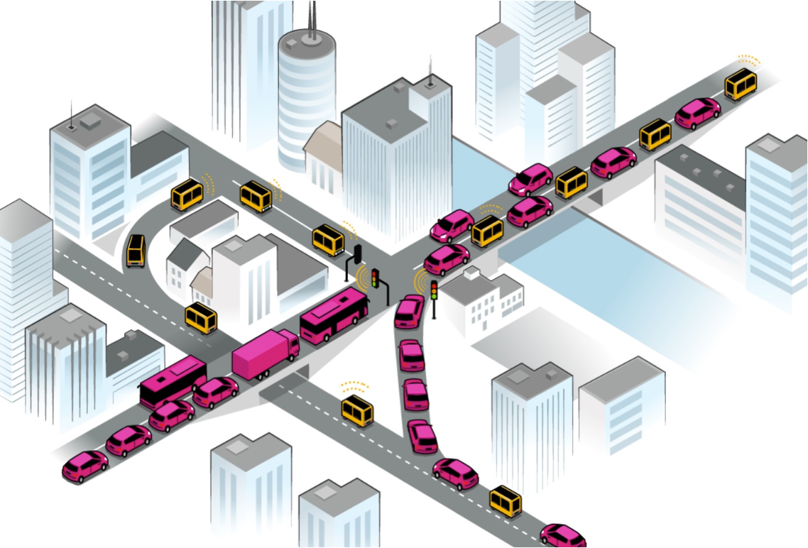
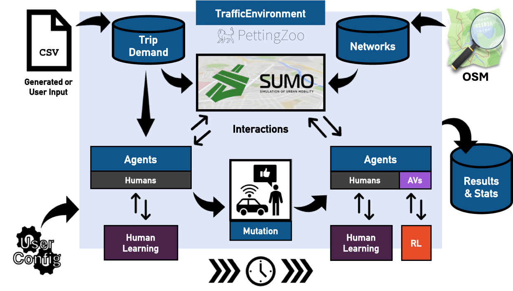
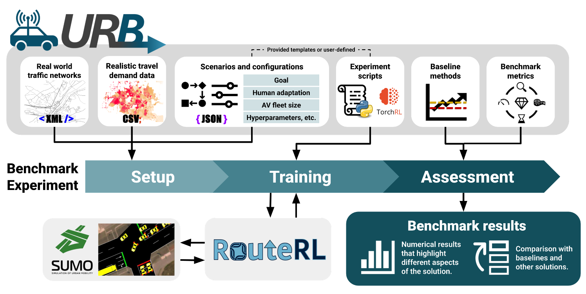
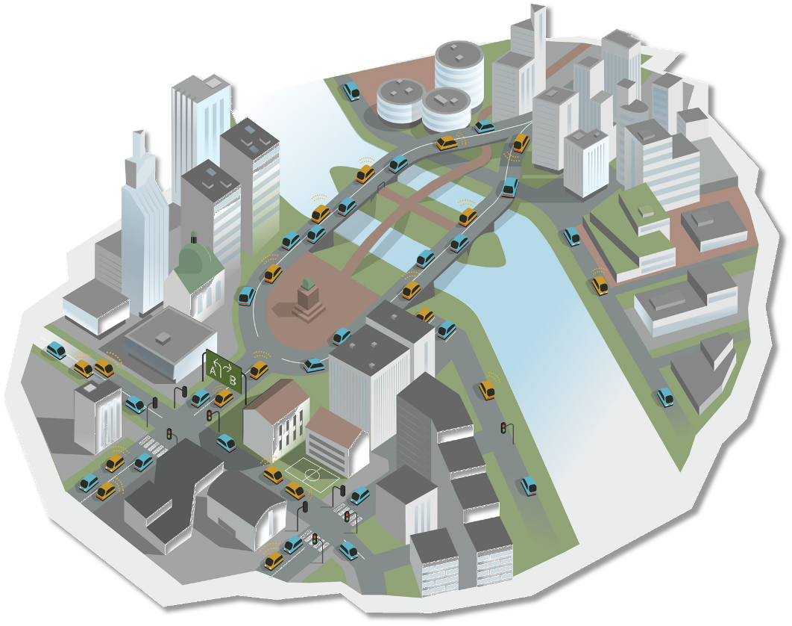
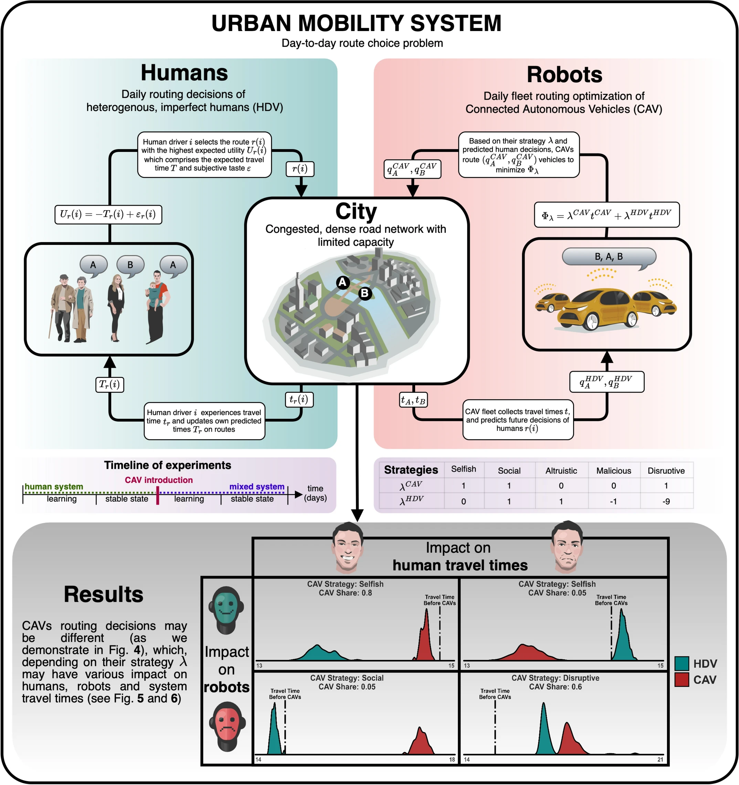

<!--
 
-->

   

  
  
  
  

  
  
  
  

**We study the new class of urban routing games, where fleets of collaborative autonomous vehicles (CAVs) learn to make better route choice decisions in mixed urban traffic systems.**

#### The core elements are:

1. [RouteRL](https://github.com/COeXISTENCE-PROJECT/RouteRL): Multi-Agent Reinforcement Learning framework for modeling and simulating the collective route choices of humans and autonomous vehicles - [SoftwareX](https://doi.org/10.1016/j.softx.2025.102279), [Docs](https://coexistence-project.github.io/RouteRL/)

2. [URB](https://github.com/COeXISTENCE-PROJECT/URB) - Urban Routing Benchmark: Benchmarking MARL algorithms on the fleet routing tasks - [NeurIPS 2025](https://proceedings.neurips.cc/paper_files/paper/2025/file/77e5b98de7d7060bc7c57d7943b53d8f-Paper-Datasets_and_Benchmarks_Track.pdf), [Website](https://www.urbenchmark.com), [Leaderboard](https://coexistence-project.github.io/URB/)

---

#### With which you may run a standard task, such as:

    

> In the town of Nemours inhabited only by human drivers, at some point, a given share of drivers _mutate_ to CAVs and delegate their routing decisions to algorithms.
> Then, for a period of time, the CAV agents develop routing strategies to minimize their delay (e.g. using MARL).
> This process (both learning and new state) affects traffic and all its users (human and autonomous vehicles).

 [RouteRL](https://github.com/COeXISTENCE-PROJECT/RouteRL) can run this task for an arbitrary city with arbitrary demand (most likely from predefined case studies) and configuration. You may use some algorithm (own or from [TorchRL](https://github.com/pytorch/rl)) and analyze results to draw conclusions.
 

  

 Then, you may compete in [URB](https://github.com/COeXISTENCE-PROJECT/URB) to dominate [the official leaderboard](https://coexistence-project.github.io/URB/) with your best-performing algorithm tested across variety of tasks.
 

  

🏃‍♀️  In the typical use-case: 

> * You import road network of a given urban areas from [`Open Street Map`](https://www.openstreetmap.org/#map=19/50.030513/19.906586).
> * You generate a demand pattern, where each of agents is specified with own traits and travel demans $(o_i, d_i, \tau_i$).
> * You control your experiment with a `.json` file and specify details of conducted experiment (or set of experiments).
> * You specify your human behaviour models to accurately reproduce how human drivers select routes.
> * You generate choice set of paths for each agent to select from.
> * You connect with `SUMO` traffic simulator to be used as environment to compute travel costs.
> * You run $n$ days of human learning (`SUMO days`), hoping the system will stabilize in proximity of Wardrop User Equilibrium.
> * You introduce mutation and replace some human agents with `CAVs`.
> * You determine `reinforcement learning` algorithm for each agent by defining rewards, observations and hyperparameters.
> * You `train` your algorithms until it finds suitable `policy`.
> * You roll-out the trained policy and observe impact of new routing on the system.
> * You further allow humans to adapt to actions of `CAVs` and allow `CAVs` to refine its policies.

---

### 🧑‍💻 Software

Complete list of available software (work-in-progress, sandboxes, discontinued projects, or side quests) is:

1\. [JanuX](https://github.com/COeXISTENCE-PROJECT/JanuX) — Tool for generating a set of path options in directed graphs. Designed for efficient routing and creating path options for custom requirements.

 

2\. [GenTTP](https://github.com/COeXISTENCE-PROJECT/OptimalAssignment) — Leading to optimal assigment by approximating SUMO with ML methods.

3\. [demandify](https://github.com/COeXISTENCE-PROJECT/demandify) — Reproduce real-world traffic congestion with synthetic demand calibration for agent-based traffic scenarios using genetic algorithms.

 

4\. [OpenURB](https://github.com/COeXISTENCE-PROJECT/OpenURB) — A benchmark for testing MARL algorithms for CAV route choice under dynamic CAV-HDV changes.

 

5\. [Coalition formation](https://github.com/COeXISTENCE-PROJECT/Coalition_formation_in_mixed_traffic_with_AVs_) — We demonstrate (for the first time) that CAVs may form exclusive routing coalitions in traffic.

6\. [General Decision Model](https://github.com/COeXISTENCE-PROJECT/GeneralDecisionModel) — Framework to simulate the decision process of humans that can join CAV fleet.

7\. [RoutingZOO](https://github.com/COeXISTENCE-PROJECT/RoutingZoo) — A simulation platform where virtual drivers experiment with routing strategies to navigate from origins to destinations in dense urban networks.

8\. [Wardropian Cycles](https://github.com/COeXISTENCE-PROJECT/Wardropian_cycles) — A concept bridging between System Optimum and User Equilibrium Assignment in a day-to-day context.

9\. [parcour](https://github.com/COeXISTENCE-PROJECT/parcour) — An early prototype version of _RouteRL_ by Onur Akman.

10\. [BottleCOEX](https://github.com/COeXISTENCE-PROJECT/BottleCOEX) — Lightweight Simulation of coexistence of CAVs and human drivers in two-route bottleneck scenarios with a macroscopic traffic model.

    

---

### 🤝 Get in touch

🔖 For the overview of scientific contributions and societal impact see the [COeXISTENCE](https://www.rafalkucharskilab.pl/research/coexistence/) group web page.

🫵 To collaborate [mail us](mailto:coexistence@uj.edu.pl) or see contribution guidelines at repsective repositories.

👩‍🎓 Prospective students, PhDs or visiting scholars welcomed - please mail [Rafał Kucharski](mailto:rafal.kucharski@uj.edu.pl).

---
### Credits

This project is developed within the [COeXISTENCE](https://www.rafalkucharskilab.pl/research/coexistence/) project  
(ERC Starting Grant, grant agreement No. 101075838), based at Jagiellonian University in Kraków, Poland.

#### Project members

  
  
  
  
  

  
  
  
  
  

#### Affiliated contributors and former members

  
  
  
  
  

### 🔎 Pipeline at glance (from [here](https://www.nature.com/articles/s41598-025-90783-w))

  

  

